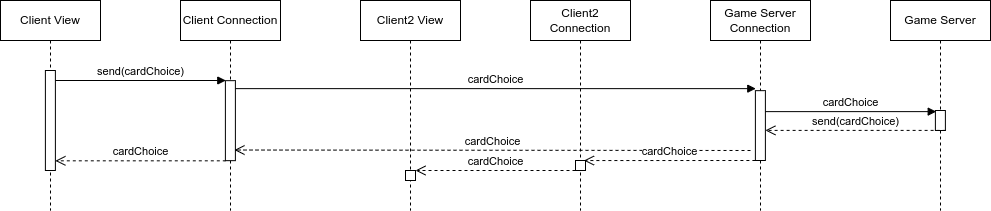

# Eryantis Protocol Documentation

Pietro Mello Rella, Tommaso Montanari, Riccardo Negri

Group 1

## Networking Messages
- **Login (String username, PlayerNumber playerNumber, GameMode advancedRules):** After
opening a new connection the first message must be always a login where the client tells
the server his identity. In the case of the matchmaking server also the information
about the desired game mode is used.
- **Redirect (int port):** Matchmaking server response to the login message,
after the game server has been chosen.

- **Disconnect:** Is never sent through the network but is a fake message created when
the socket lose the connection or when a user connection goes down (achieved by send ping messages every x seconds).
- **UserDisconnect: (String username):** When the server reads a Disconnect message
from a client sends this message to all the users. 
- **UserReconnected (String username):** When the game server receives a login from an already existing
user send this message to all the other clients.
- **UserResigned (String username):** The user can send this message to the server to
communicate he wants to quit the game, the server will broadcast the message to
everyone else. In case of user disconnected and reconnection time elapsed the server
will send this message to all the remaining users and communicate the end of the game.

## Updates Messages
- **InitialState (String model):** When the game starts send the model to all the users,
when a user reconnects send the current model just to him. The model is sent as a json
string.

## Moves Messages
All the moves can be sent from the client to the server to communicate the intention to do
it and, as a response to the intention, from the server to all the clients to apply the
move effect.

### Standard Moves
- **CardChoice (int card):** At the beginning of each round all the players need to select an assistant card.

- **DiningRoomMovement (StudentColor student):** During the first part of the action phase, 
a player can decide to move one of the students from the entrance to the dining room.
- **IslandMovement (StudentColor student, int islandId):** During the first part of the action phase,
  a player can decide to move one of the students from the entrance to a chosen island.

\newpage

- **MotherNatureMovement (int steps):** During the second part of the action phase,
 the players needs to move mother nature by X amount of steps.

- **\*CloudChoice (int cloudId, List\<StudentColor> extracted):** During the third and last part of the action phase, the player 
 needs to choose a cloud to take the students from. If that student is the last student playing in the round, the information about the refill
of the clouds will be also sent.

\newpage

### Character Activation
Can be sent at any moment during the action phase.

- **\*Character1 (StudentColor taken, int islandId, List\<StudentColor> extracted)**: 
Take student from character card and place it on an island, then refill the card 
from the bag.
- **Character2 ()**: Take control of professors even if you have the same number of students as the player
who currently controls them.
- **Character3 (int islandGroupId)**: Resolve the chosen island group without moving
mother nature.
- **Character4 ()**: You may move mother nature up to 2 additional islands.
- **Character5 (int islandId)**: Take a no entry tile from this card and place it on
an island.
- **Character6 ():** Towers do not count towards influence when resolving an island.
- **Character7 (List\<StudentColor> taken, List\<StudentColor> given):** Swap 3 
students from your entrance with this card.
- **Character8 ():** You have 2 more influence points when calculating the influence.
- **Character9 (StudentColor color):** During this turn the students of the chosen
color give no influence.
- **Character10 (List\<StudentColor> taken, List\<StudentColor> given):** Swap 2
students from your entrance with your dining room.
- **\*Character11 (StudentColor student, List\<StudentColor> extracted)**:
Take a student from the character card and place it in your dining room, then refill 
the card with a student from the bag.
- **Character12 (StudentColor color)**: Every player must return 3 students of the chosen color from
the dining room to the bag.

*When sent from the server to the clients, will contain also a list of the students extracted from the bag.
