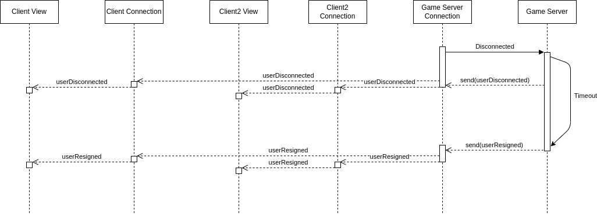

# Eryantis Protocol Documentation

Pietro Mello Rella, Tommaso Montanari, Riccardo Negri

Group 1

## Networking Messages
- **Login (String username):** After opening a new connection the first message must be always
a login where the client tells the server his identity.
- **ErrorMessage:** Sent as a response to a Login, means the login was refused and the connection closed,
is a result of the username being already taken or invalid.
- **LobbiesList (List\<LobbyDescriptor> lobbies):** If the login is accepted the server replies with the list of lobbies
waiting for players. If the client fails to join a lobby the server sends the updated list.
- **CreateLobby (PlayerNumber playerNumber, GameMode advancedRules):** The client asks the server to create a game with
the specified parameters, after the creation the server redirects the user to the new game server.
- **LobbyChoice (String code):** The client asks to be assigned to a specific lobby giving the lobby code,
the user receives a Redirect as a response or the updated LobbiesList if the lobby is not available anymore.
- **Redirect (int port):** The Matchmaking server sends this message to tell the client
which game server was assigned to, is sent as a response to a lobby choice, a lobby creation
or a login if the user has already an ongoing game.

- **Disconnect:** Is never sent through the network but is a fake message created when
the socket loses the connection (achieved with periodic ping messages).
- **UserDisconnect: (String username):** When the server reads a Disconnect message
from a client sends this message to all the users. 
- **UserConnected (String username):** When a user enters the lobby or reconnects to an ongoing game,
the game server sends this message to all the other clients.
- **UserResigned (String username):** The user can send this message to the server to
communicate he wants to quit the game, the server will broadcast the message to
everyone. In case of user inactive or disconnected if the timout elapses the server
will send this message to all the remaining users and communicate the end of the game.

## Updates Messages
- **InitialState (String model):** When the game starts send the model to all the users,
when a user reconnects send the current model just to him. The model is sent as a json
string.
- **Ping:** A message that does nothing but is sent every 20 seconds to reset the socket timeout.
If the socket doesn't receive any message for 30 seconds that means the connection is lost and a
Disconnected message is produced.

## Moves Messages
All the moves can be sent from the client to the server to communicate the intention to do
it and, as a response to the intention, from the server to all the clients to apply the
move effect.

### Standard Moves
- **CardChoice (int card):** At the beginning of each round all the players need to select an assistant card.

- **DiningRoomMovement (StudentColor student):** During the first part of the action phase, 
a player can decide to move one of the students from the entrance to the dining room.
- **IslandMovement (StudentColor student, int islandId):** During the first part of the action phase,
  a player can decide to move one of the students from the entrance to a chosen island.

\newpage

- **MotherNatureMovement (int steps):** During the second part of the action phase,
 the players needs to move mother nature by a specified amount of steps.

- **\*CloudChoice (int cloudId, List\<StudentColor> extracted):** During the third and last part of the action phase, the player 
 needs to choose a cloud to take the students from. If that student is the last student playing in the round, the information about the refill
of the clouds will be also sent.

\newpage

### Character Activation
Can be sent at any moment during the action phase.

- **\*Character1 (StudentColor taken, int islandId, List\<StudentColor> extracted)**: 
Take student from character card and place it on an island, then refill the card 
from the bag.
- **Character2 ()**: Take control of professors even if you have the same number of students as the player
who currently controls them.
- **Character3 (int islandGroupId)**: Resolve the chosen island group without moving
mother nature.
- **Character4 ()**: You may move mother nature up to 2 additional islands.
- **Character5 (int islandId)**: Take a no entry tile from this card and place it on
an island.
- **Character6 ():** Towers do not count towards influence when resolving an island.
- **Character7 (List\<StudentColor> taken, List\<StudentColor> given):** Swap 3 
students from your entrance with this card.
- **Character8 ():** You have 2 more influence points when calculating the influence.
- **Character9 (StudentColor color):** During this turn the students of the chosen
color give no influence.
- **Character10 (List\<StudentColor> taken, List\<StudentColor> given):** Swap 2
students from your entrance with your dining room.
- **\*Character11 (StudentColor student, List\<StudentColor> extracted)**:
Take a student from the character card and place it in your dining room, then refill 
the card with a student from the bag.
- **Character12 (StudentColor color)**: Every player must return 3 students of the chosen color from
the dining room to the bag.

*When sent from the server to the clients, will contain also a list of the students extracted from the bag.
